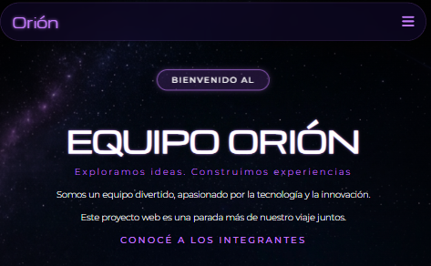
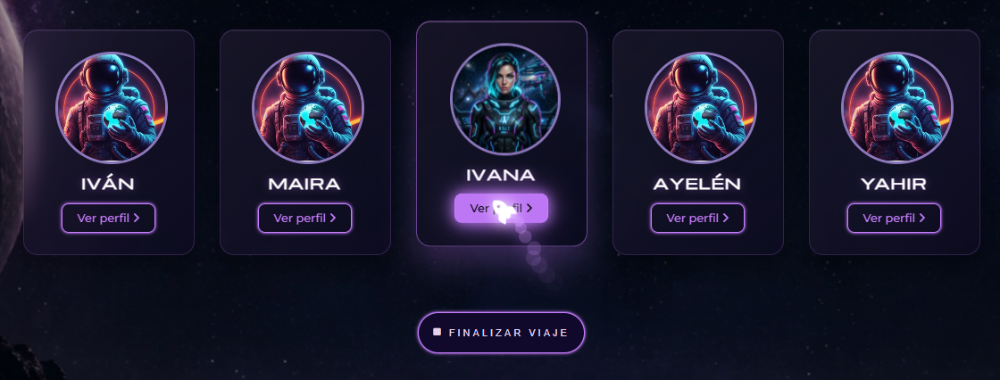
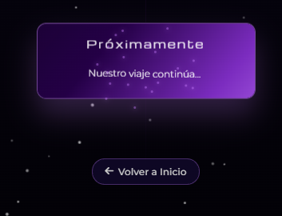
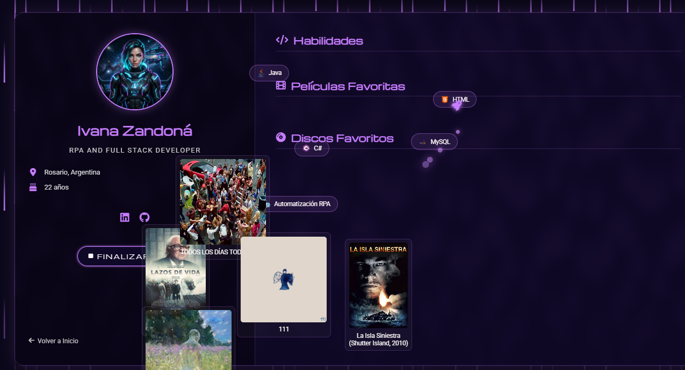
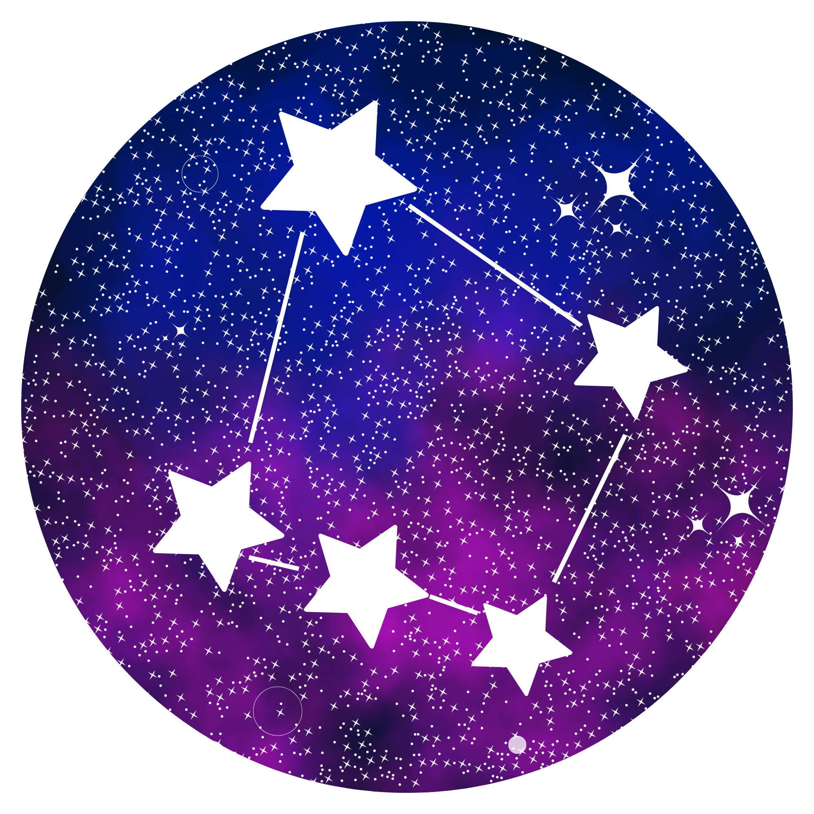
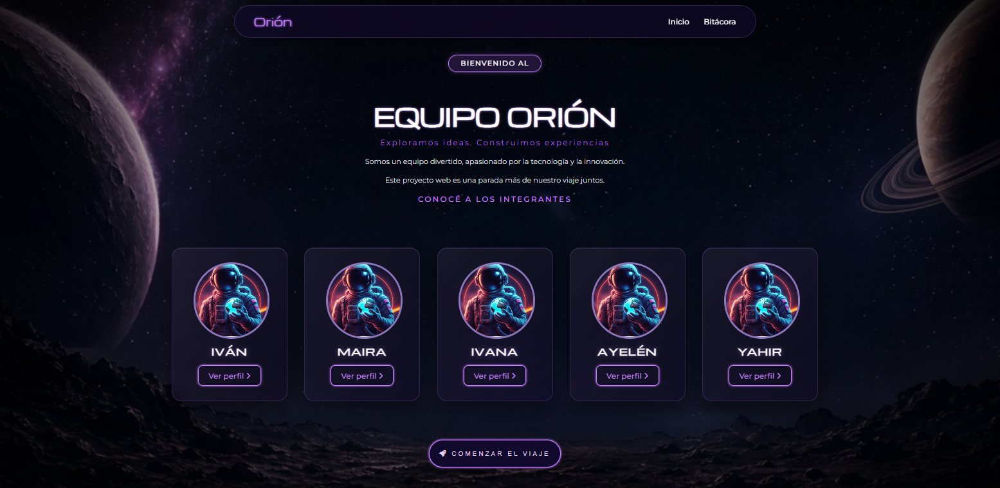
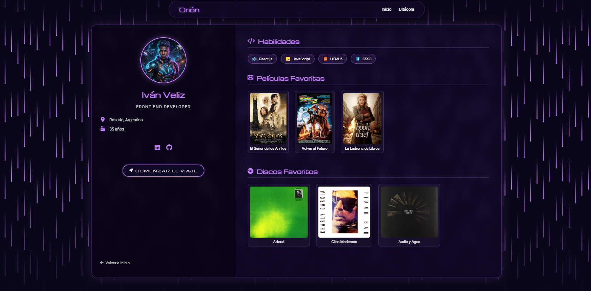
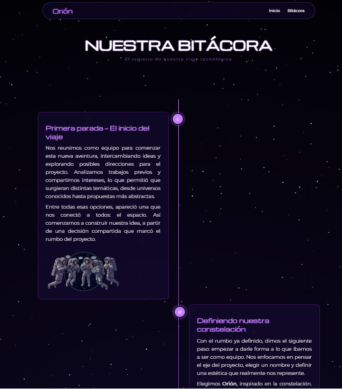

# Equipo Orión - Proyecto Web

## Descripción

Página web de presentación y bitácora del Equipo Orión, desarrollada como trabajo práctico para la Tecnicatura en Desarrollo de Software.

El sitio apuesta por una estética inspirada en el espacio, con colores oscuros, tipografías modernas y animaciones suaves. Incluye una sección de bienvenida, tarjetas de integrantes y una bitácora que documenta el proceso creativo y técnico.

## Objetivos del proyecto

- Mostrar la identidad del equipo.
- Documentar el proceso de creación con una bitácora visual.
- Incluir animaciones y diseño responsivo.
- Usar tecnologías web básicas para una página estática.

## Integrantes del Equipo

- **Iván** ([Github](https://github.com/IvanaZandona))
- **Maira** ([Github](https://github.com/mairammedina29))
- **Ivana** ([Github](https://github.com/Ivanveliz))
- **Ayelén** ([Github](https://github.com/mariaayelen))
- **Yahir** ([Github](https://github.com/yahirperez2899-dotcom))

## Tecnologías utilizadas

- **HTML5**: Estructura de la página y contenidos.
- **CSS3**: Estilos, diseño responsivo y efectos visuales.
- **JavaScript**: Animaciones, control de partículas y comportamiento dinámico.
- **Font Awesome**: Iconos para navegación y redes.
- **Google Fonts**: Tipografías `Michroma` y `Montserrat`.
- **ScrollReveal**: Animaciones al hacer scroll.
- **tsParticles**: Fondo de partículas en movimiento.

## Estructura del proyecto

```
TP1-Front/
├── index.html                    # Página principal
├── README.md                     # Documentación del proyecto
├── assets/
│   └── img/                      # Imágenes y recursos visuales
├── css/
│   └── style.css                 # Estilos globales del sitio
├── js/
│   └── script.js                 # Comportamiento y animaciones globales
└── pages/
    ├── bitacora/
    │   ├── bitacora.html         # Página de bitácora del proyecto
    │   └── styles.css            # Estilos específicos de la bitácora
    │
    └── profiles/
        ├── gravity.js            # Efectos dinámicos compartidos (partículas/animaciones)
        ├── styles.css            # Estilos compartidos para perfiles
        │
        ├── ayelen/
        │   ├── page.html         # Perfil individual de Ayelén
        │   └── assets/
        │       ├── discos/       # Imágenes de discos favoritos
        │       ├── imageSkills/  # Iconos de habilidades
        │       └── movies/       # Imágenes de películas favoritas
        │
        ├── ivan/
        │   ├── page.html         # Perfil individual de Iván
        │   └── assets/
        │       ├── discos/       # Imágenes de discos favoritos
        │       ├── imageSkills/  # Iconos de habilidades
        │       └── movies/       # Imágenes de películas favoritas
        │
        ├── ivana/
        │   ├── page.html         # Perfil individual de Ivana
        │   └── assets/
        │       ├── discos/       # Imágenes de discos favoritos
        │       ├── imageSkills/  # Iconos de habilidades
        │       └── movies/       # Imágenes de películas favoritas
        │
        ├── maira/
        │   ├── page.html         # Perfil individual de Maira
        │   └── assets/
        │       ├── discos/       # Imágenes de discos favoritos
        │       ├── imageSkills/  # Iconos de habilidades
        │       └── movies/       # Imágenes de películas favoritas
        │
        └── yahir/
            ├── page.html         # Perfil individual de Yahir
            └── assets/
                ├── discos/       # Imágenes de discos favoritos
                ├── imageSkills/  # Iconos de habilidades
                └── movies/       # Imágenes de películas favoritas
```

## Contenido principal

### `index.html`
- Página de inicio con presentación del equipo.
- Secciones de bienvenida, integrantes y llamada a la acción.
- Botón principal para comenzar el viaje.
- Footer con branding y redes sociales.

### `pages/bitacora/bitacora.html`
- Línea de tiempo con hitos del desarrollo.
- Tarjetas de bitácora con texto e imagen.
- Animaciones de entrada para cada tarjeta.
- Fondo de partículas activo con `tsParticles`.

### `pages/profiles/ayelen/page.html`, `pages/profiles/ivan/page.html`, `pages/profiles/ivana/page.html`, `pages/profiles/maira/page.html`, `pages/profiles/yahir/page.html`
- Perfiles individuales personalizados de cada integrante.
- Incluyen secciones de música, películas y habilidades.
- Implementan lógica propia de partículas y gravedad desde `gravity.js`.
- Cada perfil tiene sus propios assets (discos, habilidades, películas).

### `css/style.css`
- Estilos generales para todo el sitio.
- Diseño responsivo para desktop y mobile.
- Temas de color, tipografía y efectos de neón.

### `pages/profiles/styles.css`
- Estilos específicos para la sección de perfiles.
- Diseño de tarjetas, badges y grillas de contenido.
- Animaciones y efectos visuales para integrantes.

### `js/script.js`
- Menú hamburguesa responsivo.
- Animaciones del cursor personalizado (cohete).
- Efectos de gravedad cero e interactividad.
- ScrollReveal para animaciones al hacer scroll.

### `pages/profiles/gravity.js`
- Efectos dinámicos específicos de la sección de perfiles.
- Control de partículas y animaciones personalizadas.
- Estilos específicos para tarjetas, navbar y footer.

### `js/script.js`
- Inicializa `ScrollReveal` para animar secciones con scroll.
- Configura el fondo de partículas con `tsParticles`.
- Controla el efecto visual del footer al llegar al final de la página.

## Cómo ejecutar el proyecto

1. Descarga o clona el repositorio a tu PC.
2. Abre `index.html` directamente en el navegador.
3. Navega hacia la bitácora o los perfiles desde los enlaces del menú.

> El proyecto es estático; no necesita servidor. Sin embargo, si querés probarlo con un servidor local, podés usar `Live Server` en VS Code.

## Guía de Estilos
### Paleta de Colores 

- Fondo principal: #000000
- Texto principal: #ffffff
- Color primario (neón): #c77dff
- Primario claro: #d192ff
- Primario oscuro: #9d4edd
- Secundario: #3f1161
- Acento: #8c77bb
- Fondo tarjetas: #10092b
- Hover tarjetas: #1a0f3a
- Texto secundario: #e1d1ed

## Tipografías

- Títulos:
https://fonts.google.com/specimen/Michroma
- Texto general:
https://fonts.google.com/specimen/Montserrat

## JavaScript

### Funcionalidades implementadas:
- Menú hamburguesa
  - Se implementó un menú hamburguesa para dispositivos móviles
  - Se activa en resoluciones menores a 768px
  - Permite mostrar/ocultar el menú de navegación
   
- ScrollReveal
 - Se utilizó la librería ScrollReveal para animar elementos al hacer scroll
 - Se aplica a los elementos con la clase .revelable
 - Utilizado en Bitácora
- tsParticles
  - Se implementó la librería tsParticles
  - Fondo animado con partículas
  - Refuerza la ambientación espacial
     
- Efectos visuales
  - Flip cards en integrantes (CSS + interacción)
  - Botones con efecto neón
  - Animaciones hover
- Cursor personalizado (cohete)
  - Se activa dinámicamente con JavaScript
  - Sigue el movimiento del mouse con animación fluida 
  - Genera partículas tipo “humo” al moverse
  
- Texto animado en tarjetas
  - Genera una animación progresiva al interactuar con la tarjeta
- Efecto de chispas en tarjetas 
  - Se implementó una animación al pasar el cursor sobre tarjetas
  - Genera partículas que se dispersan desde el centro
    
- Modo gravedad cero interactivo
  - Un sistema de animación que simula un entorno sin gravedad en el perfil de cada integrante
  - Se activa mediante el botón "Comenzar viaje"
  - Los elementos (habilidades y tarjetas) flotan libremente por la pantalla
   


## Personalización rápida

- Para cambiar el logo, reemplaza `./assets/img/logo.png` y actualiza el nombre si es necesario.
- Para agregar más tarjetas a la bitácora, copia una tarjeta existente en `bitacora.html` y cambia el contenido.
- Para ajustar la animación de scroll, edita los valores en `js/script.js` dentro de `ScrollReveal().reveal(...)`.

## Problemas comunes

- Si las animaciones no aparecen, verifica que `ScrollReveal` y `tsParticles` carguen correctamente en el navegador.
- Si las imágenes no se ven, revisa que las rutas dentro de `assets/img/` estén bien escritas.

## Mejoras futuras sugeridas

- Completar las páginas individuales del resto de los integrantes.
- Añadir más interactividad a las tarjetas tipo flip card.
- Optimizar la carga de imágenes usando formatos modernos (WebP).
- Crear una versión con dark mode automático.

## Capturas de Pantalla

(Agregar imágenes del proyecto)
# Equipo Orión - Proyecto Web



## Vista de la página principal



## Sección de integrantes



## Bitácora




Muchos elementos como animaciones principalmente y partes del código están basados en trabajos previos propios y en recursos consultados (como tutoriales de YouTube y ejemplos en línea). Estos fueron adaptados y modificados para integrarlos al proyecto según nuestra estética y necesidades.

## Uso de Inteligencia Artificial
- Herramientas utilizadas
  - ChatGPT
  - Copilot 
  - Google Geminis

La Inteligencia Artificial fue utilizada como herramienta de apoyo tanto en la generación de contenido como en la resolución de problemas técnicos durante el desarrollo del proyecto.

Uso en contenido:

Redacción de textos descriptivos para el README
Reformulación de explicaciones técnicas para lograr mayor claridad 
Organización de funcionalidades y documentación del proyecto

Uso en código y debugging:

Resolución de errores en CSS, especialmente en diseño responsive (alineación de elementos, posicionamiento de la línea de la bitácora y adaptación a dispositivos móviles)
Corrección de conflictos visuales y de estilos que afectaban la interfaz (por ejemplo, superposición de elementos y problemas de visibilidad)
Asistencia en la integración y funcionamiento de JavaScript, incluyendo:
Eventos (addEventListener)
Manipulación del DOM
Animaciones con requestAnimationFrame
Ayuda en la comprensión y documentación de bloques de código complejos (animaciones, efectos visuales y lógica interactiva), por ejemplo, se trabajó en la integración de librerías como ScrollReveal y tsParticles, donde la IA ayudó a configurar correctamente los parámetros

Para la generación de avatares se tomó en cuenta lo siguiente: tomamos una imagen real de cada miembre y solicitamos un fusión para generar un avatar de una tripulación espacial, con traje táctico futurista, estética cyberpunk, con colores neón púrpura, fondo con temática espacial de , alta calidad.

## Enlace al Proyecto Desplegado "Agregar Link"

## Licencia

Proyecto académico sin licencia específica.

## Créditos

Desarrollado por el Equipo Orión como parte de la Tecnicatura en Desarrollo de Software.
